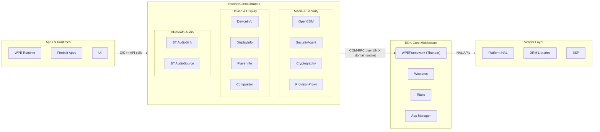
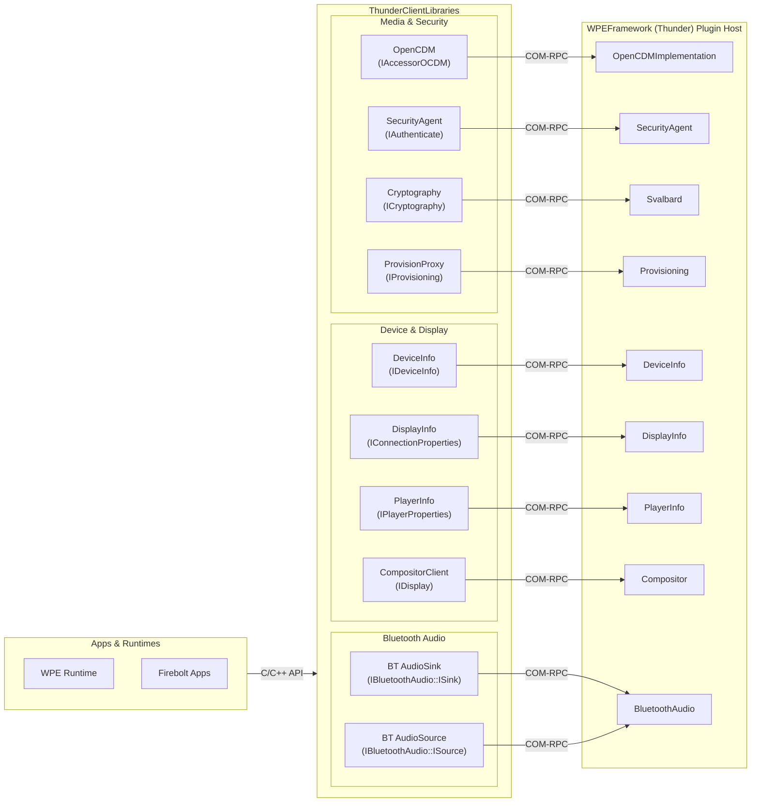
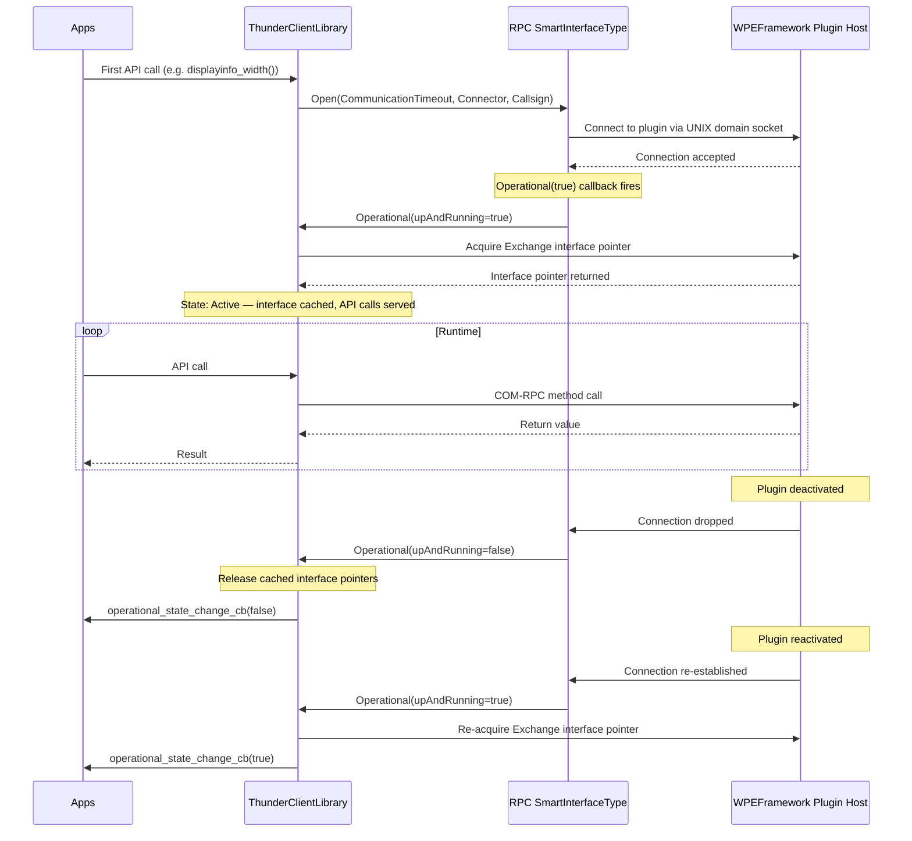
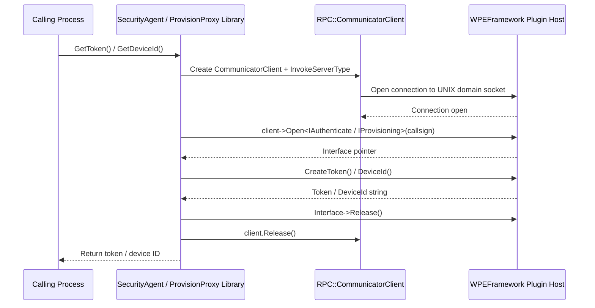
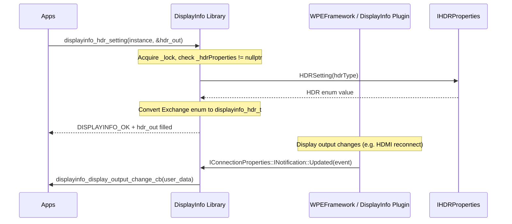
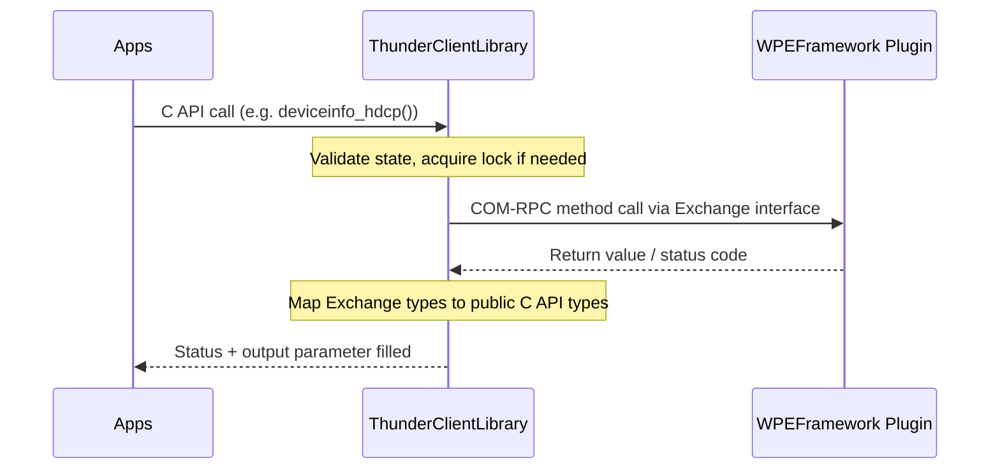
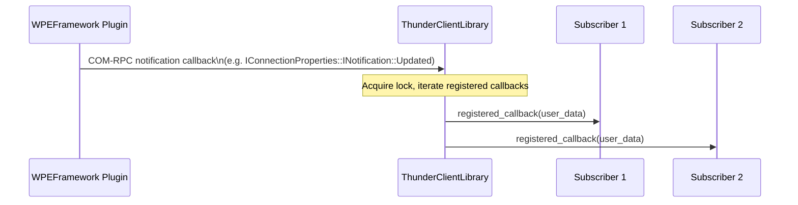

# ThunderClientLibraries

ThunderClientLibraries is a collection of lightweight, process-boundary client libraries that enable out-of-process components — such as media pipelines, browser runtimes, and application runtimes — to consume services hosted inside the WPEFramework (Thunder) plugin host. Each library exposes a stable C or C++ API and internally uses Thunder's COM-RPC mechanism to communicate across process boundaries.

ThunderClientLibraries acts as the consumer-side glue between user-space processes and Thunder-hosted services. Rather than each consuming process implementing its own IPC logic, each library encapsulates the connection setup, interface acquisition, and lifecycle management required to reach a specific Thunder plugin. The libraries are kept independent of one another; a consuming process links only the libraries it needs.

At the device level, these libraries serve processes that sit outside the Thunder plugin host but require access to capabilities that are managed centrally inside it. Examples include media pipeline processes that require DRM session creation through OpenCDM, web runtimes that need display or device capability metadata, and Bluetooth audio pipelines that need to stream audio frames to or from a paired device. All inter-process calls go over UNIX domain sockets using Thunder's COM-RPC transport, providing lightweight and low-latency IPC without requiring TCP/IP.

At the module level, each library follows a consistent pattern: it establishes a COM-RPC client connection to the target Thunder plugin, acquires the relevant Exchange interface, and exposes a C-compatible function set to the calling process. Libraries that require change notifications register a notification sink with the plugin and dispatch callbacks to registered callers when events arrive.

**Key Features & Responsibilities:**

- **OpenCDM (OCDM) Client**: Provides the Open Content Decryption Module interface to media pipelines and browser runtimes, enabling DRM system selection, license session creation, and encrypted content decryption across a process boundary.
- **SecurityAgent Client**: Exposes a `GetToken()` function that allows out-of-process callers to obtain a signed authentication token from the SecurityAgent plugin, required for authorizing JSON-RPC calls to Thunder plugins.
- **DeviceInfo Client**: Provides structured access to device hardware capabilities including supported video outputs, HDCP versions, audio outputs, audio codec capabilities, and screen resolutions, via the `Exchange::IDeviceInfo` family of interfaces.
- **DisplayInfo Client**: Delivers display connection properties such as HDR mode, HDCP protection level, EDID data (color formats, color depths, audio formats, aspect ratios, supported refresh rates), and resolution to processes that need to adapt media rendering to the connected display.
- **PlayerInfo Client**: Exposes current player capabilities including supported audio and video codecs, playback resolution, and Dolby sound mode configuration, and delivers Dolby audio mode-change notifications to registered callers.
- **CompositorClient**: Provides a C++ graphics and input abstraction layer (`IDisplay`, `ISurface`, `IKeyboard`, `IPointer`, `ITouchPanel`) that allows out-of-process renderers to create surfaces and receive input events through the compositor without being tightly coupled to a specific display server.
- **Cryptography Client**: Bridges callers to the Svalbard cryptographic vault service, exposing hash, cipher, Diffie-Hellman key exchange, random number generation, and persistent key storage operations through `Exchange::ICryptography` and related interfaces.
- **ProvisionProxy Client**: Provides `GetDeviceId()` and `GetDRMId()` functions to retrieve the unique device identifier and DRM credentials from the Provisioning service, connecting over `Exchange::IProvisioning`.
- **BluetoothAudioSink Client**: Delivers a C API through which an audio pipeline process can configure an active Bluetooth audio sink, acquire/relinquish the sink, submit audio frames over a shared memory buffer, and track connection state changes.
- **BluetoothAudioSource Client**: Delivers a C API through which an audio pipeline process can receive audio frames from a connected Bluetooth audio source via a shared memory buffer, and register callbacks for source state changes and audio stream events.

---

## Design

ThunderClientLibraries is designed around the separation between interface consumers and interface providers. Each library is a thin client that holds a single managed connection to its corresponding Thunder plugin; it does not implement any business logic. The design ensures that the same Thunder Exchange interfaces that are used inside the plugin host are reachable from any external process without reimplementing transport code.

Connection management is centralised within each library through a singleton or a smart interface type (`RPC::SmartInterfaceType`). The `RPC::SmartInterfaceType` base class automatically handles reconnection when a plugin is deactivated and reactivated, delivering operational state callbacks to registered callers so that consuming processes can react to plugin availability changes without polling. Libraries that do not require this reconnect behaviour — specifically SecurityAgent and ProvisionProxy — use a per-call `RPC::CommunicatorClient` that opens, performs the call, and releases the connection.

Northbound interactions (towards applications and runtimes) are provided as C-compatible exported functions or, in the case of CompositorClient, as abstract C++ interfaces. C wrappers allow consumption from language runtimes that cannot directly call C++ virtual interfaces. Southbound interactions (towards Thunder plugins) are realised entirely via COM-RPC over UNIX domain sockets, matching the socket paths established by the corresponding plugins.

State that needs to survive across calls is held by the Thunder plugin on the other side of the IPC boundary. The libraries cache live interface pointers acquired from an open connection; these are released when the plugin goes offline and reacquired when it comes back.

### Threading Model

- **Threading Architecture**: Multi-threaded; each library manages its own thread(s) independently.
- **Main Thread**: Each library's public API functions are called from the consuming application's thread. COM-RPC dispatch into and out of the library can occur on the calling thread or on the RPC engine's worker thread depending on which side initiates the call.
- **Worker Threads**:
  - _RPC Invoke Server Thread_ (`RPC::InvokeServerType<1, 0, 4>`): Present in SecurityAgent and ProvisionProxy per-call clients; processes incoming RPC responses on a single worker thread.
  - _RPC SmartInterface Engine Thread_: Present in DeviceInfo, DisplayInfo, PlayerInfo, Cryptography, BluetoothAudioSink, BluetoothAudioSource; handles COM-RPC incoming callbacks and reconnection logic.
  - _Receiver Thread_ (BluetoothAudioSource only): A dedicated `Core::Thread` that blocks on the shared memory buffer waiting for audio frames from the source and dispatches them to the registered frame callback.
- **Synchronization**: `Core::CriticalSection` is used inside DisplayInfo, PlayerInfo, and Cryptography libraries to protect the cached interface pointers and registered callback maps from concurrent access during plugin operational state changes.
- **Async / Event Dispatch**: Notification callbacks (display output changes, player Dolby mode changes, Bluetooth state changes, plugin operational state changes) are delivered synchronously on the RPC engine thread. Consuming processes must not perform blocking operations inside these callbacks.

### RDK-V Platform and Integration Requirements

- **WPEFramework Version**: Thunder 4.4.1 (RDK8)
- **Build Dependencies**: `entservices-apis` (provides Thunder Exchange interface headers), `wpeframework-tools-native` (code generation tools), `gstreamer1.0` (required when `CDMI=ON` and the GStreamer adapter is selected).
- **Plugin Dependencies**: Each library requires the corresponding Thunder plugin to be active at runtime. SecurityAgent requires the SecurityAgent plugin; OpenCDM requires the OpenCDMImplementation plugin; DeviceInfo requires the DeviceInfo plugin; DisplayInfo requires the DisplayInfo plugin; PlayerInfo requires the PlayerInfo plugin; Cryptography requires the Svalbard plugin; ProvisionProxy requires the Provisioning plugin; BluetoothAudio libraries require the BluetoothAudio plugin.
- **Systemd Services**: The corresponding Thunder plugins must be running when a client library attempts a connection. Each library establishes its connection on first use, and libraries using `RPC::SmartInterfaceType` reconnect automatically once the plugin becomes available.
- **Configuration Files**: Socket endpoint paths are read from environment variables (`SECURITYAGENT_PATH`, `OPEN_CDM_SERVER`, `PROVISION_PATH`); built-in defaults are used if the variables are unset.
- **Startup Order**: Client libraries connect on first use. If the target plugin is not yet active at connection time, the calling function returns an error code. Libraries using `RPC::SmartInterfaceType` reconnect automatically once the plugin becomes available.

---

### Component State Flow

#### Initialization to Active State

Libraries using `RPC::SmartInterfaceType` (DeviceInfo, DisplayInfo, PlayerInfo, Cryptography, BluetoothAudioSink, BluetoothAudioSource) follow this lifecycle. Libraries using per-call clients (SecurityAgent, ProvisionProxy) establish and release a fresh connection for every API call.

#### Runtime State Changes

**State Change Triggers:**

- When the target Thunder plugin is deactivated (e.g., due to a configuration change or crash), the `RPC::SmartInterfaceType` detects the dropped connection, calls `Operational(false)` on the library, and the library releases all cached interface pointers and notifies registered callers via their `operational_state_change_cb`.
- When the plugin is reactivated, `Operational(true)` is called and the library reacquires all interface pointers, restoring full functionality without requiring the consuming process to reinitialize.

**Context Switching Scenarios:**

- If a consuming process deregisters all operational state callbacks and disposes the library singleton (e.g., `displayinfo_dispose()`, `playerinfo_dispose()`), the COM-RPC connection is cleanly closed.
- BluetoothAudioSink and BluetoothAudioSource additionally track the audio device connection state (UNASSIGNED → DISCONNECTED → CONNECTING → CONNECTED / CONNECTED_BAD / CONNECTED_RESTRICTED → READY → STREAMING) and deliver state change notifications independently of the Thunder plugin operational state.

---

### Call Flows

#### Initialization Call Flow

The following shows the per-call pattern used by SecurityAgent and ProvisionProxy. A new client connection is created for each call.

#### Request Processing Call Flow

The following shows a typical API call on a persistent SmartInterfaceType-based library (DisplayInfo shown as example).

---

## Internal Modules

| Module / Class           | Description                                                                                                                                                                                                                                                          | Key Files                                            |
| ------------------------ | -------------------------------------------------------------------------------------------------------------------------------------------------------------------------------------------------------------------------------------------------------------------- | ---------------------------------------------------- |
| `OpenCDMAccessor`        | Singleton that manages the COM-RPC connection to the OpenCDMImplementation plugin. Holds session key maps and provides the `IAccessorOCDM` interface proxy. Receives external data: DRM system metadata and key status updates from the plugin.                      | `open_cdm_impl.h`, `open_cdm_impl.cpp`               |
| `OpenCDMSession`         | Represents a single DRM session. Holds the session ID, the remote `Exchange::ISession` interface, and decrypt context. Created via `OpenCDMAccessor`. Receives external data: license responses and key status changes from the plugin.                              | `open_cdm_impl.h`, `open_cdm_impl.cpp`               |
| `SecurityAgent ipclink`  | Per-call COM-RPC client that connects to the SecurityAgent plugin, calls `IAuthenticate::CreateToken()`, and releases the connection.                                                                                                                                | `ipclink.cpp` (securityagent)                        |
| `DeviceInfo`             | Singleton wrapping `RPC::SmartInterfaceType<Exchange::IDeviceInfo>`. Queries video/audio capability interfaces and maps Exchange enums to the public C API enums.                                                                                                    | `DeviceInfo.cpp`, `deviceinfo.h`                     |
| `DisplayInfo`            | Singleton wrapping `RPC::SmartInterfaceType<Exchange::IConnectionProperties>`. Also queries `IHDRProperties` and `IGraphicsProperties`. Registers `IConnectionProperties::INotification` to deliver display-change events.                                           | `DisplayInfo.cpp`, `displayinfo.h`                   |
| `PlayerInfo`             | Singleton wrapping `RPC::SmartInterfaceType<Exchange::IPlayerProperties>`. Queries `Exchange::Dolby::IOutput` and registers `Dolby::IOutput::INotification` for Dolby mode-change events.                                                                            | `PlayerInfo.cpp`, `playerinfo.h`                     |
| `CryptographyLink`       | Singleton wrapping `RPC::SmartInterfaceType<PluginHost::IPlugin>`. Acquires `Exchange::ICryptography` and `Exchange::IDeviceObjects` from the Svalbard plugin. Adapter classes (`RPCDiffieHellmanImpl`, etc.) wrap the remote interfaces and handle connection loss. | `Cryptography.cpp`, `cryptography.h`                 |
| `ProvisionProxy ipclink` | Per-call COM-RPC client connecting to the Provisioning plugin. Implements `GetDeviceId()` and `GetDRMId()` via `Exchange::IProvisioning`.                                                                                                                            | `ipclink.cpp` (provisionproxy)                       |
| `AudioSink`              | Singleton wrapping `RPC::SmartInterfaceType<Exchange::IBluetoothAudio::ISink>`. Maintains a `Core::SharedBuffer` (`SendBuffer`) for frame delivery. Tracks sink connection state and delivers state-change callbacks.                                                | `BluetoothAudioSink.cpp`, `bluetoothaudiosink.h`     |
| `AudioSource`            | Singleton wrapping `RPC::SmartInterfaceType<Exchange::IBluetoothAudio::ISource>`. Contains a `Receiver` worker thread that reads audio frames from a `Core::SharedBuffer` and dispatches them to the registered frame callback.                                      | `BluetoothAudioSource.cpp`, `bluetoothaudiosource.h` |
| `CompositorClient`       | C++ abstraction layer (`IDisplay`, `ISurface`, `IKeyboard`, `IPointer`, `IWheel`, `ITouchPanel`). Implementation is selected at build time via `PLUGIN_COMPOSITOR_IMPLEMENTATION` and compiled from the corresponding subdirectory (e.g., `Wayland`, `Mesa`, `RPI`). | `Client.h`, `src/CMakeLists.txt`                     |

---

## Component Interactions

### Interaction Matrix

| Target Component / Layer     | Interaction Purpose                                                                           | Key APIs / Topics                                                                                               |
| ---------------------------- | --------------------------------------------------------------------------------------------- | --------------------------------------------------------------------------------------------------------------- |
| **WPEFramework Plugins**     |                                                                                               |                                                                                                                 |
| `OpenCDMImplementation`      | DRM system management and content decryption                                                  | `Exchange::IAccessorOCDM`, `Exchange::IContentDecryption`, `Exchange::ISession`                                 |
| `SecurityAgent`              | Security token acquisition for JSON-RPC authorization                                         | `PluginHost::IAuthenticate::CreateToken()`                                                                      |
| `DeviceInfo`                 | Query device video/audio output capabilities and HDCP support                                 | `Exchange::IDeviceInfo`, `Exchange::IDeviceVideoCapabilities`, `Exchange::IDeviceAudioCapabilities`             |
| `DisplayInfo`                | Query connected display properties and receive display change events                          | `Exchange::IConnectionProperties`, `Exchange::IHDRProperties`, `Exchange::IGraphicsProperties`                  |
| `PlayerInfo`                 | Query playback capabilities and receive Dolby mode change events                              | `Exchange::IPlayerProperties`, `Exchange::Dolby::IOutput`                                                       |
| `Svalbard`                   | Cryptographic operations (cipher, hash, DH, vault, random)                                    | `Exchange::ICryptography`, `Exchange::IDiffieHellman`, `Exchange::INetflixSecurity`, `Exchange::IDeviceObjects` |
| `Provisioning`               | Device ID and DRM credential retrieval                                                        | `Exchange::IProvisioning::DeviceId()`, `Exchange::IProvisioning` (DRM ID via `DRMInfo`)                         |
| `BluetoothAudio`             | Bluetooth audio sink/source streaming and state management                                    | `Exchange::IBluetoothAudio::ISink`, `Exchange::IBluetoothAudio::ISource`                                        |
| `Compositor`                 | Display surface creation and input event delivery                                             | `Thunder::Compositor::IDisplay`, `ISurface`, `IKeyboard`, `IPointer`                                            |
| **IPC Transport**            |                                                                                               |                                                                                                                 |
| COM-RPC / UNIX domain socket | All plugin communication uses Thunder COM-RPC over UNIX domain sockets                        | `RPC::CommunicatorClient`, `RPC::SmartInterfaceType`, `Core::NodeId`                                            |
| Shared Memory Buffer         | BluetoothAudioSink and BluetoothAudioSource use `Core::SharedBuffer` for audio frame transfer | `Core::SharedBuffer`                                                                                            |

### Events Published

| Event Name                                       | Trigger Condition                                                                                                                                                 | Delivered To                                                                              |
| ------------------------------------------------ | ----------------------------------------------------------------------------------------------------------------------------------------------------------------- | ----------------------------------------------------------------------------------------- |
| `displayinfo_display_output_change_cb`           | Display connection properties change (e.g. HDMI cable insert/remove), delivered via `IConnectionProperties::INotification::Updated`                               | Callers registered with `displayinfo_register_display_output_change_callback()`           |
| `displayinfo_operational_state_change_cb`        | DisplayInfo plugin goes offline or comes back online                                                                                                              | Callers registered with `displayinfo_register_operational_state_change_callback()`        |
| `playerinfo_dolby_audio_updated_cb`              | Dolby sound mode changes, delivered via `Exchange::Dolby::IOutput::INotification::AudioModeChanged`                                                               | Callers registered with `playerinfo_register_dolby_sound_mode_updated_callback()`         |
| `playerinfo_operational_state_change_cb`         | PlayerInfo plugin goes offline or comes back online                                                                                                               | Callers registered with `playerinfo_register_operational_state_change_callback()`         |
| `bluetoothaudiosink_state_changed_cb`            | Bluetooth audio sink connection state transitions (UNASSIGNED → DISCONNECTED → CONNECTING → CONNECTED / CONNECTED_BAD / CONNECTED_RESTRICTED → READY → STREAMING) | Callers registered with `bluetoothaudiosink_register_state_changed_callback()`            |
| `bluetoothaudiosink_operational_state_update_cb` | BluetoothAudio plugin goes offline or comes back online                                                                                                           | Callers registered with `bluetoothaudiosink_register_operational_state_update_callback()` |
| `bluetoothaudiosource_state_changed_cb`          | Bluetooth audio source connection state transitions                                                                                                               | Callers registered with `bluetoothaudiosource_register_state_changed_callback()`          |
| `bluetoothaudiosource_frame_cb`                  | Audio frame received from connected Bluetooth source                                                                                                              | Caller-supplied sink struct registered via `bluetoothaudiosource_set_sink()`              |

### IPC Flow Patterns

**Primary Request / Response Flow:**

**Event Notification Flow:**

---

## Implementation Details

### Major HAL APIs Integration

ThunderClientLibraries operates above the HAL boundary. Each library calls into the corresponding Thunder Exchange interface, which is served by a Thunder plugin that abstracts platform-specific HAL details. The table below lists the primary Exchange interfaces and entry-point methods consumed by each client library.

| Exchange Interface                                                                | Entry-Point Methods / Notifications                                                                                       | Consuming Library    |
| --------------------------------------------------------------------------------- | ------------------------------------------------------------------------------------------------------------------------- | -------------------- |
| `Exchange::IAccessorOCDM`                                                         | `CreateSession()`, `IsTypeSupported()`, `SetServerCertificate()`, key status notifications                                | OpenCDM              |
| `PluginHost::IAuthenticate`                                                       | `CreateToken()`                                                                                                           | SecurityAgent        |
| `Exchange::IDeviceInfo` / `IDeviceVideoCapabilities` / `IDeviceAudioCapabilities` | `SupportedVideoDisplays()`, `SupportedResolutions()`, `SupportedHdcp()`, `AudioCapabilities()`                            | DeviceInfo           |
| `Exchange::IConnectionProperties` / `IHDRProperties` / `IGraphicsProperties`      | `Width()`, `Height()`, `IsAudioPassthrough()`, `EDID()`, `HDRSetting()`, `TotalGpuRam()`                                  | DisplayInfo          |
| `Exchange::IPlayerProperties` / `Dolby::IOutput`                                  | `VideoCodecs()`, `AudioCodecs()`, `Resolution()`, `SoundMode()`, `EnableAtmosOutput()`, `AudioModeChanged()` notification | PlayerInfo           |
| `Exchange::ICryptography` / `IDiffieHellman` / `IVault`                           | `Hash()`, `Cipher()`, `DiffieHellman()`, `Vault()`, `Random()`                                                            | Cryptography         |
| `Exchange::IProvisioning`                                                         | `DeviceId()`, `DRMInfo()`                                                                                                 | ProvisionProxy       |
| `Exchange::IBluetoothAudio::ISink`                                                | `Acquire()`, `Relinquish()`, `Speed()`, `Time()`, `Latency()`, state change notifications                                 | BluetoothAudioSink   |
| `Exchange::IBluetoothAudio::ISource`                                              | `Assign()`, `Revoke()`, `Frame()`, state change notifications                                                             | BluetoothAudioSource |
| `Thunder::Compositor::IDisplay` / `ISurface`                                      | `Create()`, `Destroy()`, keyboard/pointer/touch input event dispatch                                                      | CompositorClient     |

### Key Implementation Logic

- **State / Lifecycle Management**: Libraries using `RPC::SmartInterfaceType` override the `Operational(bool)` virtual method. When `Operational(true)` is called, the library acquires interface pointers (e.g., `_displayConnection`, `_playerInterface`, `_dolbyInterface`) by calling `BaseClass::Interface()` and queries any sub-interfaces. When `Operational(false)` is called, all cached pointers are released. This is implemented in `DisplayInfo.cpp`, `PlayerInfo.cpp`, `BluetoothAudioSink.cpp`, and `BluetoothAudioSource.cpp`.

- **Event Processing**: Notification sinks are registered with the remote plugin interface immediately after the interface pointer is acquired. Incoming COM-RPC notification calls arrive on the RPC engine thread and are dispatched synchronously to all caller-registered callbacks by iterating the callback map under a `Core::CriticalSection` lock.

- **Error Handling Strategy**: COM-RPC errors and Thunder `Core::ERROR_*` codes are mapped to library-specific status enums (e.g., `deviceinfo_status_t`, `displayinfo_status_t`, `playerinfo_status_t`) and returned to callers. SecurityAgent and ProvisionProxy use negative integer return values to signal failure, where the absolute value indicates either the error code or the buffer length required. OpenCDM uses the `OpenCDMError` enum.

- **Logging & Diagnostics**: All libraries emit trace output through Thunder's `TRACE_L1` macro, routing through the Thunder tracing subsystem of the consuming process.

---

## Configuration

### Key Configuration Parameters

| Parameter                      | Type           | Default                    | Description                                                                                                                      |
| ------------------------------ | -------------- | -------------------------- | -------------------------------------------------------------------------------------------------------------------------------- |
| `SECURITYAGENT_PATH`           | env string     | `/tmp/SecurityAgent/token` | UNIX domain socket path used to connect to the SecurityAgent plugin.                                                             |
| `OPEN_CDM_SERVER`              | env string     | `/tmp/ocdm`                | UNIX domain socket path used to connect to the OpenCDMImplementation plugin.                                                     |
| `PROVISION_PATH`               | env string     | `/tmp/provision`           | UNIX domain socket path used to connect to the Provisioning plugin.                                                              |
| `BLUETOOTHAUDIOSINK` connector | compile string | `/tmp/bluetoothaudiosink`  | Shared buffer name for audio frame transfer to the BluetoothAudio sink (set in `BluetoothAudioSink.cpp` as `#define CONNECTOR`). |

### Configuration Persistence

Configuration changes (environment variable overrides) are not persisted across reboots.
