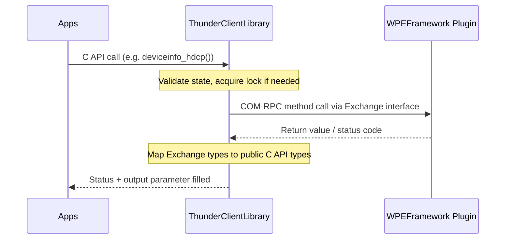
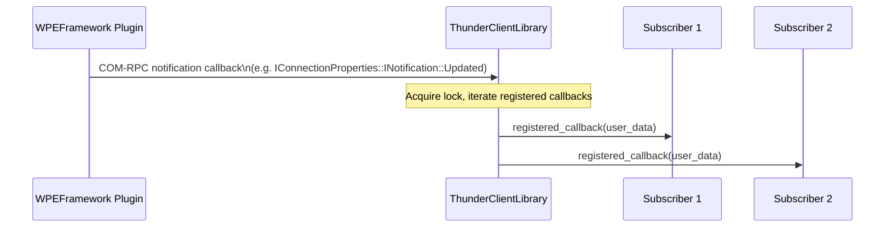

# ThunderClientLibraries

ThunderClientLibraries is a collection of lightweight, process-boundary client libraries that enable out-of-process components — such as media pipelines, browser runtimes, and application runtimes — to consume services hosted inside the WPEFramework (Thunder) plugin host. Each library exposes a stable C or C++ API to access the functionality provided by the corresponding Thunder service.

ThunderClientLibraries provides a stable abstraction for any component — whether a standalone application, an out-of-process runtime, or a plugin library — that needs to access services hosted inside the WPEFramework (Thunder) plugin host without a direct dependency on Thunder internals. The libraries are independent of one another; a component links only the libraries it needs.

Typical consumers include media pipeline processes requiring DRM session creation through OpenCDM, web runtimes needing display or device capability metadata, Bluetooth audio pipelines streaming audio to or from a paired device, and plugin libraries that need access to Thunder-hosted functionality without a direct dependency on Thunder internals.

**Key Features & Responsibilities:**

- **OpenCDM (OCDM) Client**: Provides the Open Content Decryption Module interface to media pipelines and browser runtimes, enabling DRM system selection, license session creation, and encrypted content decryption across a process boundary.
- **SecurityAgent Client**: Exposes a `GetToken()` function that allows out-of-process callers to obtain a signed authentication token from the SecurityAgent plugin, required for authorizing JSON-RPC calls to Thunder plugins.
- **DeviceInfo Client**: Provides structured access to device hardware capabilities including supported video outputs, HDCP versions, audio outputs, audio codec capabilities, and screen resolutions, via the `Exchange::IDeviceInfo` family of interfaces.
- **DisplayInfo Client**: Delivers display connection properties such as HDR mode, HDCP protection level, EDID data (color formats, color depths, audio formats, aspect ratios, supported refresh rates), and resolution to processes that need to adapt media rendering to the connected display.
- **PlayerInfo Client**: Exposes current player capabilities including supported audio and video codecs, playback resolution, and Dolby sound mode configuration, and delivers Dolby audio mode-change notifications to registered callers.
- **CompositorClient**: Provides a C++ graphics and input abstraction layer (`Thunder::Compositor::IDisplay`, `Thunder::Compositor::IDisplay::ISurface`, `Thunder::Compositor::IDisplay::IKeyboard`, `Thunder::Compositor::IDisplay::IPointer`, `Thunder::Compositor::IDisplay::IWheel`, `Thunder::Compositor::IDisplay::ITouchPanel`) that allows out-of-process renderers to create surfaces and receive input events through the compositor without being tightly coupled to a specific display server.
- **Cryptography Client**: Bridges callers to the Svalbard cryptographic vault service, exposing hash, cipher, Diffie-Hellman key exchange, random number generation, and persistent key storage operations through `Exchange::ICryptography` and related interfaces.
- **ProvisionProxy Client**: Provides `GetDeviceId()` and `GetDRMId()` functions to retrieve the unique device identifier and DRM credentials from the Provisioning service, connecting over `Exchange::IProvisioning`.
- **BluetoothAudioSink Client**: Delivers a C API through which an audio pipeline process can configure an active Bluetooth audio sink, acquire/relinquish the sink, submit audio frames over a shared memory buffer, and track connection state changes.
- **BluetoothAudioSource Client**: Delivers a C API through which an audio pipeline process can receive audio frames from a connected Bluetooth audio source via a shared memory buffer, and register callbacks for source state changes and audio stream events.

---

## Internal Modules

| Module / Class           | Description                                                                                                                                                                                                                                                          | Key Files                                            |
| ------------------------ | -------------------------------------------------------------------------------------------------------------------------------------------------------------------------------------------------------------------------------------------------------------------- | ---------------------------------------------------- |
| `OpenCDMAccessor`        | Singleton that manages the COM-RPC connection to the OpenCDMImplementation plugin. Holds session key maps and provides the `IAccessorOCDM` interface proxy. Receives external data: DRM system metadata and key status updates from the plugin.                      | `open_cdm_impl.h`, `open_cdm_impl.cpp`               |
| `OpenCDMSession`         | Represents a single DRM session. Holds the session ID, the remote `Exchange::ISession` interface, and decrypt context. Created via `OpenCDMAccessor`. Receives external data: license responses and key status changes from the plugin.                              | `open_cdm_impl.h`, `open_cdm_impl.cpp`               |
| `SecurityAgent ipclink`  | Per-call COM-RPC client that connects to the SecurityAgent plugin, calls `PluginHost::IAuthenticate::CreateToken()`, and releases the connection.                                                                                                                    | `ipclink.cpp` (securityagent)                        |
| `DeviceInfo`             | Singleton wrapping `RPC::SmartInterfaceType<Exchange::IDeviceInfo>`. Queries video/audio capability interfaces and maps Exchange enums to the public C API enums.                                                                                                    | `DeviceInfo.cpp`, `deviceinfo.h`                     |
| `DisplayInfo`            | Singleton wrapping `RPC::SmartInterfaceType<Exchange::IConnectionProperties>`. Also queries `IHDRProperties` and `IGraphicsProperties`. Registers `IConnectionProperties::INotification` to deliver display-change events.                                           | `DisplayInfo.cpp`, `displayinfo.h`                   |
| `PlayerInfo`             | Singleton wrapping `RPC::SmartInterfaceType<Exchange::IPlayerProperties>`. Queries `Exchange::Dolby::IOutput` and registers `Dolby::IOutput::INotification` for Dolby mode-change events.                                                                            | `PlayerInfo.cpp`, `playerinfo.h`                     |
| `CryptographyLink`       | Singleton wrapping `RPC::SmartInterfaceType<PluginHost::IPlugin>`. Acquires `Exchange::ICryptography` and `Exchange::IDeviceObjects` from the Svalbard plugin. Adapter classes (`RPCDiffieHellmanImpl`, etc.) wrap the remote interfaces and handle connection loss. | `Cryptography.cpp`, `cryptography.h`                 |
| `ProvisionProxy ipclink` | Per-call COM-RPC client connecting to the Provisioning plugin. Implements `GetDeviceId()` and `GetDRMId()` via `Exchange::IProvisioning`.                                                                                                                            | `ipclink.cpp` (provisionproxy)                       |
| `AudioSink`              | Singleton wrapping `RPC::SmartInterfaceType<Exchange::IBluetoothAudio::ISink>`. Maintains a `Core::SharedBuffer` (`SendBuffer`) for frame delivery. Tracks sink connection state and delivers state-change callbacks.                                                | `BluetoothAudioSink.cpp`, `bluetoothaudiosink.h`     |
| `AudioSource`            | Singleton wrapping `RPC::SmartInterfaceType<Exchange::IBluetoothAudio::ISource>`. Contains a `Receiver` worker thread that reads audio frames from a `Core::SharedBuffer` and dispatches them to the registered frame callback.                                      | `BluetoothAudioSource.cpp`, `bluetoothaudiosource.h` |
| `CompositorClient`       | C++ abstraction layer (`Thunder::Compositor::IDisplay`, `Thunder::Compositor::IDisplay::ISurface`, `Thunder::Compositor::IDisplay::IKeyboard`, `Thunder::Compositor::IDisplay::IPointer`, `Thunder::Compositor::IDisplay::IWheel`, `Thunder::Compositor::IDisplay::ITouchPanel`). Implementation is selected at build time via `PLUGIN_COMPOSITOR_IMPLEMENTATION` and compiled from the corresponding subdirectory (e.g., `Wayland`, `Mesa`, `RPI`). | `Client.h`, `src/CMakeLists.txt`                     |

---

## Component Interactions

### Interaction Matrix

| Target Component / Layer     | Interaction Purpose                                                                           | Key APIs / Topics                                                                                               |
| ---------------------------- | --------------------------------------------------------------------------------------------- | --------------------------------------------------------------------------------------------------------------- |
| **WPEFramework Plugins**     |                                                                                               |                                                                                                                 |
| `OpenCDMImplementation`      | DRM system management and content decryption                                                  | `Exchange::IAccessorOCDM`, `Exchange::IContentDecryption`, `Exchange::ISession`                                 |
| `SecurityAgent`              | Security token acquisition for JSON-RPC authorization                                         | `PluginHost::IAuthenticate::CreateToken()`                                                                      |
| `DeviceInfo`                 | Query device video/audio output capabilities and HDCP support                                 | `Exchange::IDeviceInfo`, `Exchange::IDeviceVideoCapabilities`, `Exchange::IDeviceAudioCapabilities`             |
| `DisplayInfo`                | Query connected display properties and receive display change events                          | `Exchange::IConnectionProperties`, `Exchange::IHDRProperties`, `Exchange::IGraphicsProperties`                  |
| `PlayerInfo`                 | Query playback capabilities and receive Dolby mode change events                              | `Exchange::IPlayerProperties`, `Exchange::Dolby::IOutput`                                                       |
| `Svalbard`                   | Cryptographic operations (cipher, hash, DH, vault, random)                                    | `Exchange::ICryptography`, `Exchange::IDiffieHellman`, `Exchange::INetflixSecurity`, `Exchange::IDeviceObjects` |
| `Provisioning`               | Device ID and DRM credential retrieval                                                        | `Exchange::IProvisioning::DeviceId()`, `Exchange::IProvisioning` (DRM ID via `DRMInfo`)                         |
| `BluetoothAudio`             | Bluetooth audio sink/source streaming and state management                                    | `Exchange::IBluetoothAudio::ISink`, `Exchange::IBluetoothAudio::ISource`                                        |
| `Compositor`                 | Display surface creation and input event delivery                                             | `Thunder::Compositor::IDisplay`, `Thunder::Compositor::IDisplay::ISurface`, `Thunder::Compositor::IDisplay::IKeyboard`, `Thunder::Compositor::IDisplay::IPointer`, `Thunder::Compositor::IDisplay::IWheel`, `Thunder::Compositor::IDisplay::ITouchPanel`      |
| **IPC Transport**            |                                                                                               |                                                                                                                 |
| COM-RPC (UNIX domain socket / TCP) | Plugin communication uses Thunder COM-RPC (UNIX domain sockets on Linux; TCP loopback endpoints are used on Windows when configured by the client / environment) | `RPC::CommunicatorClient`, `RPC::SmartInterfaceType`, `Core::NodeId` |
| Shared Memory Buffer         | BluetoothAudioSink and BluetoothAudioSource use `Core::SharedBuffer` for audio frame transfer | `Core::SharedBuffer`                                                                                            |

### Events Published

| Event Name                                       | Trigger Condition                                                                                                                                                 | Delivered To                                                                              |
| ------------------------------------------------ | ----------------------------------------------------------------------------------------------------------------------------------------------------------------- | ----------------------------------------------------------------------------------------- |
| `displayinfo_display_output_change_cb`           | Display connection properties change (e.g. HDMI cable insert/remove), delivered via `IConnectionProperties::INotification::Updated`                               | Callers registered with `displayinfo_register_display_output_change_callback()`           |
| `displayinfo_operational_state_change_cb`        | DisplayInfo plugin goes offline or comes back online                                                                                                              | Callers registered with `displayinfo_register_operational_state_change_callback()`        |
| `playerinfo_dolby_audio_updated_cb`              | Dolby sound mode changes, delivered via `Exchange::Dolby::IOutput::INotification::AudioModeChanged`                                                               | Callers registered with `playerinfo_register_dolby_sound_mode_updated_callback()`         |
| `playerinfo_operational_state_change_cb`         | PlayerInfo plugin goes offline or comes back online                                                                                                               | Callers registered with `playerinfo_register_operational_state_change_callback()`         |
| `bluetoothaudiosink_state_changed_cb`            | Bluetooth audio sink connection state transitions (UNASSIGNED → DISCONNECTED → CONNECTING → CONNECTED / CONNECTED_BAD / CONNECTED_RESTRICTED → READY → STREAMING) | Callers registered with `bluetoothaudiosink_register_state_changed_callback()`            |
| `bluetoothaudiosink_operational_state_update_cb` | BluetoothAudio plugin goes offline or comes back online                                                                                                           | Callers registered with `bluetoothaudiosink_register_operational_state_update_callback()` |
| `bluetoothaudiosource_state_changed_cb`          | Bluetooth audio source connection state transitions                                                                                                               | Callers registered with `bluetoothaudiosource_register_state_changed_callback()`          |
| `bluetoothaudiosource_frame_cb`                  | Audio frame received from connected Bluetooth source                                                                                                              | Caller-supplied sink struct registered via `bluetoothaudiosource_set_sink()`              |

### IPC Flow Patterns

**Primary Request / Response Flow:**

```mermaid
sequenceDiagram
    participant App as Apps
    participant Lib as ThunderClientLibrary
    participant Thunder as WPEFramework Plugin

    App->>Lib: C API call (e.g. deviceinfo_hdcp())
    Note over Lib: Validate state, acquire lock if needed
    Lib->>Thunder: COM-RPC method call via Exchange interface
    Thunder-->>Lib: Return value / status code
    Note over Lib: Map Exchange types to public C API types
    Lib-->>App: Status + output parameter filled
```

**Event Notification Flow:**

```mermaid
sequenceDiagram
    participant Thunder as WPEFramework Plugin
    participant Lib as ThunderClientLibrary
    participant App1 as Subscriber 1
    participant App2 as Subscriber 2

    Thunder->>Lib: COM-RPC notification callback\n(e.g. IConnectionProperties::INotification::Updated)
    Note over Lib: Acquire lock, iterate registered callbacks
    Lib->>App1: registered_callback(user_data)
    Lib->>App2: registered_callback(user_data)
```

---

## Implementation Details

### Major HAL APIs Integration

ThunderClientLibraries operates above the HAL boundary. Each library calls into the corresponding Thunder Exchange interface, which is served by a Thunder plugin that abstracts platform-specific HAL details. The table below lists the primary Exchange interfaces and entry-point methods consumed by each client library.

| Exchange Interface                                                                | Entry-Point Methods / Notifications                                                                                       | Consuming Library    |
| --------------------------------------------------------------------------------- | ------------------------------------------------------------------------------------------------------------------------- | -------------------- |
| `Exchange::IAccessorOCDM`                                                         | `CreateSession()`, `IsTypeSupported()`, `SetServerCertificate()`, key status notifications                                | OpenCDM              |
| `PluginHost::IAuthenticate`                                                       | `CreateToken()`                                                                                                           | SecurityAgent        |
| `Exchange::IDeviceInfo` / `IDeviceVideoCapabilities` / `IDeviceAudioCapabilities` | `SupportedVideoDisplays()`, `SupportedResolutions()`, `SupportedHdcp()`, `AudioCapabilities()`                            | DeviceInfo           |
| `Exchange::IConnectionProperties` / `IHDRProperties` / `IGraphicsProperties`      | `Width()`, `Height()`, `IsAudioPassthrough()`, `EDID()`, `HDRSetting()`, `TotalGpuRam()`                                  | DisplayInfo          |
| `Exchange::IPlayerProperties` / `Dolby::IOutput`                                  | `VideoCodecs()`, `AudioCodecs()`, `Resolution()`, `SoundMode()`, `EnableAtmosOutput()`, `AudioModeChanged()` notification | PlayerInfo           |
| `Exchange::ICryptography` / `IDiffieHellman` / `IVault`                           | `Hash()`, `Cipher()`, `DiffieHellman()`, `Vault()`, `Random()`                                                            | Cryptography         |
| `Exchange::IProvisioning`                                                         | `DeviceId()`, `DRMInfo()`                                                                                                 | ProvisionProxy       |
| `Exchange::IBluetoothAudio::ISink`                                                | `Acquire()`, `Relinquish()`, `Speed()`, `Time()`, `Latency()`, state change notifications                                 | BluetoothAudioSink   |
| `Exchange::IBluetoothAudio::ISource`                                              | `Assign()`, `Revoke()`, `Frame()`, state change notifications                                                             | BluetoothAudioSource |
| `Thunder::Compositor::IDisplay` / `ISurface`                                      | `Create()`, `Destroy()`, keyboard/pointer/touch input event dispatch                                                      | CompositorClient     |

### Key Implementation Logic

- **State / Lifecycle Management**: Libraries using `RPC::SmartInterfaceType` override the `Operational(bool)` virtual method. When `Operational(true)` is called, the library acquires interface pointers (e.g., `_displayConnection`, `_playerInterface`, `_dolbyInterface`) by calling `BaseClass::Interface()` and queries any sub-interfaces. When `Operational(false)` is called, all cached pointers are released. This is implemented in `DisplayInfo.cpp`, `PlayerInfo.cpp`, `BluetoothAudioSink.cpp`, and `BluetoothAudioSource.cpp`.

- **Event Processing**: Notification sinks are registered with the remote plugin interface immediately after the interface pointer is acquired. Incoming COM-RPC notification calls arrive on the RPC engine thread and are dispatched synchronously to all caller-registered callbacks by iterating the callback map under a `Core::CriticalSection` lock.

- **Error Handling Strategy**: COM-RPC errors and Thunder `Core::ERROR_*` codes are mapped to library-specific status enums (e.g., `deviceinfo_status_t`, `displayinfo_status_t`, `playerinfo_status_t`) and returned to callers. SecurityAgent and ProvisionProxy use negative integer return values to signal failure, where the absolute value indicates either the error code or the buffer length required. OpenCDM uses the `OpenCDMError` enum.

- **Logging & Diagnostics**: Libraries emit trace output through Thunder's tracing macros (e.g. `TRACE_L1`, `TRACE_GLOBAL`), routing through the Thunder tracing subsystem of the consuming process.
